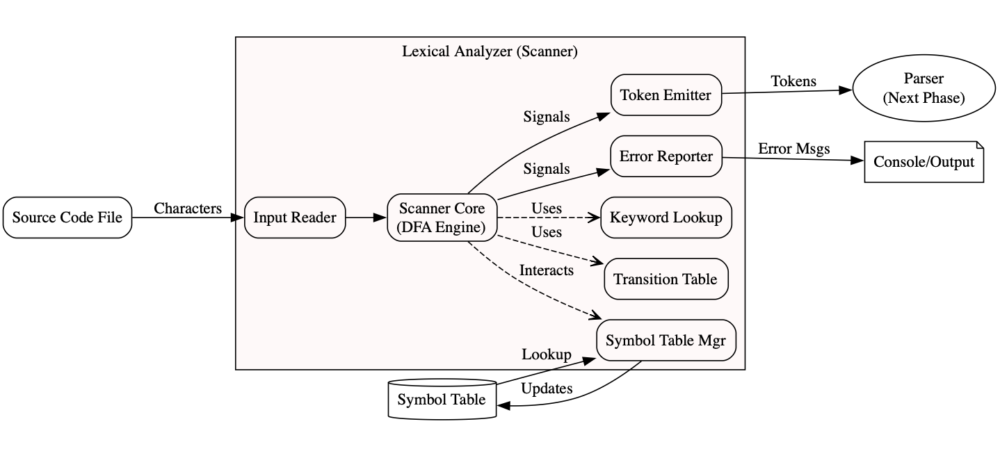

# Architecture Diagram

This Markdown file contains the DOT code for a high-level architecture diagram of the Lexical Analyzer. The diagram illustrates the internal components of the lexer, their relationships, and how they interact with external entities.

 ---
 

## 🔍 Visualize the Architecture Diagram

To see a visual representation of this architecture:

1. Open [https://dreampuf.github.io/GraphvizOnline](https://dreampuf.github.io/GraphvizOnline).
2. Copy the DOT code provided below.
3. Paste it into the editor on the website.
4. Make sure the engine is set to `dot`.
5. The diagram will be rendered automatically.

---

## 📄 DOT Code for Lexer Architecture

```dot
digraph Architecture {
    rankdir=LR; // Layout left-to-right
    node [shape=box, style=rounded]; // Default shape for components

    // --- External Entities ---
    SCF [label="Source Code File"];
    PARSER [label="Parser\n(Next Phase)", shape=ellipse];
    SYMTBL [label="Symbol Table", shape=cylinder]; // Database shape for table
    OUTPUT [label="Console/Output", shape=note];

    // --- Lexer Components (using a cluster for visual grouping) ---
    subgraph cluster_Lexer {
        label = "Lexical Analyzer (Scanner)";
        bgcolor="#FFF9F9"; // Light background for the cluster

        IN_RDR   [label="Input Reader"];
        CORE     [label="Scanner Core\n(DFA Engine)"];
        TBL      [label="Transition Table"];
        KW_LKP   [label="Keyword Lookup"];
        SYM_MGR  [label="Symbol Table Mgr"];
        EMIT     [label="Token Emitter"];
        ERR_RPT  [label="Error Reporter"];
    }

    // --- Connections/Data Flow ---
    SCF -> IN_RDR [label=" Characters"];
    IN_RDR -> CORE;
    CORE -> TBL [label=" Uses", style=dashed, arrowhead=open]; // Dashed for dependency/usage
    CORE -> KW_LKP [label=" Uses", style=dashed, arrowhead=open];
    CORE -> SYM_MGR [label=" Interacts", style=dashed, arrowhead=open];
    CORE -> EMIT [label=" Signals"];
    CORE -> ERR_RPT [label=" Signals"];

    SYM_MGR -> SYMTBL [label=" Updates"];
    SYMTBL -> SYM_MGR [label=" Lookup"]; // Separate arrows for clarity

    EMIT -> PARSER [label=" Tokens"];

    ERR_RPT -> OUTPUT [label=" Error Msgs"];
}
