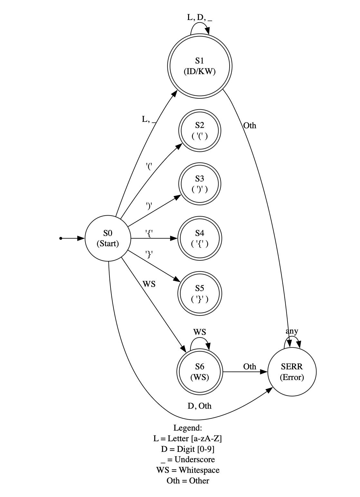

# DFA Visualization

This markdown file contains the DOT code for a deterministic finite automaton (DFA) used in the Lexical Analyzer. You can visualize this DFA using the Graphviz Online Viewer.

 ---
 

## 🔗 Visualize the DFA

1. Go to [https://dreampuf.github.io/GraphvizOnline](https://dreampuf.github.io/GraphvizOnline).
2. Copy the DOT code below.
3. Paste it into the editor on the website.
4. Choose the `dot` engine from the dropdown if it’s not already selected.
5. The DFA will be rendered automatically.

---

## 🎯 DOT Code for DFA

```dot
digraph LexerDFA {
    rankdir=LR; // Layout left-to-right
    node [shape = circle]; // Default node shape

    // --- Accepting States ---
    node [shape = doublecircle];
    S1 [label="S1\n(ID/KW)"];    // Identifier / Keyword
    S2 [label="S2\n( '(' )"];    // (
    S3 [label="S3\n( ')' )"];    // )
    S4 [label="S4\n( '{' )"];    // {
    S5 [label="S5\n( '}' )"];    // }
    S6 [label="S6\n(WS)"];       // Whitespace (ignored)

    // --- Non-accepting States ---
    node [shape = circle];
    S0 [label="S0\n(Start)"];
    SERR [label="SERR\n(Error)"];

    // --- Start Point ---
    StartPoint [shape=point, width=0];
    StartPoint -> S0;

    // --- Transitions from S0 ---
    S0 -> S1   [label="L, _"];      // L = letter [a-zA-Z], _ = underscore
    S0 -> S2   [label="'('"];
    S0 -> S3   [label="')'"];
    S0 -> S4   [label="'{'"];
    S0 -> S5   [label="'}'"];
    S0 -> S6   [label="WS"];        // WS = whitespace (space, tab, newline)
    S0 -> SERR [label="D, Oth"];    // D = digit [0-9], Oth = other chars

    // --- Transitions from S1 (Identifier/Keyword) ---
    S1 -> S1   [label="L, D, _"];
    S1 -> SERR [label="Oth"]; // invalid char inside identifier

    // --- Transitions from S6 (Whitespace) ---
    S6 -> S6   [label="WS"];
    S6 -> SERR [label="Oth"]; // invalid after whitespace if unexpected

    // --- Error State ---
    SERR -> SERR [label="any"];

    // --- Notes ---
    // States S2–S5: single symbols, accept immediately, next char goes to S0.

    // --- Legend ---
    label="Legend:\n L = Letter [a-zA-Z]\n D = Digit [0-9]\n _ = Underscore\n WS = Whitespace\n Oth = Other";
    labelloc="b";
}